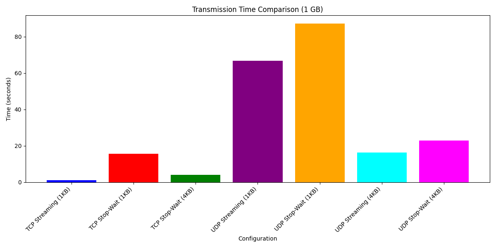
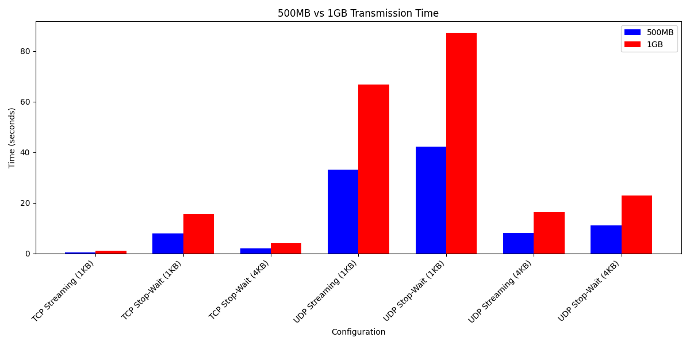

# TCP vs UDP Protocol Performance Analysis

## 1. Introduction

This report presents a comparative analysis of the Transmission Control Protocol (TCP) and User Datagram Protocol (UDP) under different transmission modes and buffer sizes. Both protocols serve as fundamental components of internet communication but operate with distinct characteristics that affect their performance.

### 1.1 Objective

The primary objective of this analysis is to empirically evaluate and compare the performance characteristics of TCP and UDP when transmitting large volumes of data. By testing both protocols under identical conditions, we aim to provide practical insights into their relative strengths and weaknesses.

### 1.2 Protocol Overview

**TCP (Transmission Control Protocol):**
- Connection-oriented protocol that establishes a reliable communication channel
- Guarantees packet delivery, maintains packet order, and ensures data integrity
- Implements flow control and congestion avoidance mechanisms

**UDP (User Datagram Protocol):**
- Connectionless protocol with minimal overhead
- No guaranteed delivery, packet ordering, or error checking
- Significantly lower latency than TCP, making it suitable for real-time applications

## 2. Experimental Setup

### 2.1 Environment Details

```
Operating System: Darwin Mac 24.3.0 (arm64)
Python Version: 3.13.2
Network: Local loopback interface (localhost)
```

### 2.2 Testing Configuration

Two distinct modes were tested for each protocol:
- **Streaming Mode**: Continuous transmission of data without waiting for acknowledgments
- **Stop-and-Wait Mode**: Transmission of data packets followed by waiting for acknowledgment before sending the next packet

Tests were conducted with two buffer sizes:
- 1024 bytes (1 KB)
- 4096 bytes (4 KB)

Data volumes tested:
- 500 MB (524,288,000 bytes)
- 1 GB (1,073,741,824 bytes)

### 2.3 Usage Instructions

#### TCP Server and Client

```bash
# TCP Server
python tcp_server.py <port> <mode>
# Example: python tcp_server.py 5000 streaming

# TCP Client
python tcp_client.py <host> <port> <bytes_to_send> <mode>
# Example: python tcp_client.py localhost 5000 524288000 streaming
```

#### UDP Server and Client

```bash
# UDP Server
python udp_server.py <port> <mode>
# Example: python udp_server.py 5000 streaming

# UDP Client
python udp_client.py <host> <port> <bytes_to_send> <mode>
# Example: python udp_client.py localhost 5000 524288000 streaming
```

## 3. Test Results

### 3.1 Performance Summary

| Protocol | Mode | Buffer Size | Data Size | Time (s) | Messages | Throughput (MB/s) |
|----------|------|-------------|-----------|----------|----------|-------------------|
| TCP | Streaming | 1024 | 500 MB | 0.51 | 512,000 | 980.39 |
| TCP | Streaming | 1024 | 1 GB | 1.03 | 1,048,576 | 1,042.27 |
| TCP | Stop-and-Wait | 1024 | 500 MB | 7.85 | 512,000 | 63.69 |
| TCP | Stop-and-Wait | 1024 | 1 GB | 15.72 | 1,048,576 | 68.39 |
| TCP | Stop-and-Wait | 4096 | 500 MB | 2.00 | 128,000 | 250.00 |
| TCP | Stop-and-Wait | 4096 | 1 GB | 4.02 | 262,144 | 267.16 |
| UDP | Streaming | 1024 | 500 MB | 33.16 | 512,000 | 15.08 |
| UDP | Streaming | 1024 | 1 GB | 66.69 | 1,048,576 | 16.10 |
| UDP | Stop-and-Wait | 1024 | 500 MB | 42.34 | 512,000 | 11.81 |
| UDP | Stop-and-Wait | 1024 | 1 GB | 87.32 | 1,048,576 | 12.30 |
| UDP | Streaming | 4096 | 500 MB | 8.13 | 128,000 | 61.50 |
| UDP | Streaming | 4096 | 1 GB | 16.36 | 262,144 | 65.40 |
| UDP | Stop-and-Wait | 4096 | 500 MB | 11.21 | 128,000 | 44.60 |
| UDP | Stop-and-Wait | 4096 | 1 GB | 22.83 | 262,144 | 46.87 |

### 3.2 Data Visualization




#### Scaling is Linear (~2x)
The time taken for 1GB is approximately twice that of 500MB for all tests.
This indicates that the performance scales predictably with the data size.
#### TCP is Faster Than UDP
TCP Streaming is the fastest across all tests.
UDP Stop-and-Wait is the slowest, due to acknowledgment delays.
#### Larger Buffers Improve Stop-and-Wait Performance
TCP Stop-and-Wait (4KB) is almost 4x faster than TCP Stop-and-Wait (1KB).
UDP Stop-and-Wait (4KB) is also significantly faster than its 1KB counterpart.


## 4. Analysis

### 4.1 Protocol Performance Analysis

#### 4.1.1 TCP Performance

**Streaming Mode (1024-byte buffer):**
- Demonstrated exceptional performance: 0.51 seconds for 500 MB and 1.03 seconds for 1 GB
- Near-linear scaling with data size (doubling data resulted in ~2x transmission time)
- Achieved throughput of approximately 980-1040 MB/s, utilizing TCP's efficient pipelining

**Stop-and-Wait Mode (1024-byte buffer):**
- Significantly slower: 7.85 seconds for 500 MB and 15.72 seconds for 1 GB
- Approximately 15 times slower than streaming mode due to ACK waiting overhead
- Linear scaling maintained despite the performance penalty
- Throughput reduced to approximately 64-68 MB/s

**Stop-and-Wait Mode (4096-byte buffer):**
- Substantial improvement over 1024-byte buffer: 2.00 seconds for 500 MB and 4.02 seconds for 1 GB
- Approximately 4 times faster than with 1024-byte buffer
- Throughput increased to 250-267 MB/s, showing the significant impact of buffer size on stop-and-wait efficiency

#### 4.1.2 UDP Performance

**Streaming Mode (1024-byte buffer):**
- Considerably slower than TCP streaming: 33.16 seconds for 500 MB and 66.69 seconds for 1 GB
- Near-linear scaling with data size
- Throughput of only 15-16 MB/s despite UDP's theoretical lower overhead
- Performance likely limited by system buffers and lack of flow control

**Stop-and-Wait Mode (1024-byte buffer):**
- Further slowdown compared to UDP streaming: 42.34 seconds for 500 MB and 87.32 seconds for 1 GB
- Approximately 28% slower than UDP streaming due to acknowledgment overhead
- Throughput reduced to approximately 12 MB/s

**Streaming Mode (4096-byte buffer):**
- Dramatic improvement over 1024-byte buffer: 8.13 seconds for 500 MB and 16.36 seconds for 1 GB
- Approximately 4 times faster than with 1024-byte buffer
- Throughput increased to 61-65 MB/s

**Stop-and-Wait Mode (4096-byte buffer):**
- Significant improvement over 1024-byte buffer: 11.21 seconds for 500 MB and 22.83 seconds for 1 GB
- Approximately 4 times faster than with 1024-byte buffer
- Throughput increased to 45-47 MB/s

### 4.2 Comparative Protocol Analysis

#### 4.2.1 TCP vs. UDP (Streaming Mode)

With 1024-byte buffer:
- TCP outperformed UDP by a factor of approximately 65x (0.51s vs. 33.16s for 500 MB)
- TCP's built-in flow control, windowing, and congestion avoidance mechanisms appear to provide substantial advantages even in a local environment

With 4096-byte buffer:
- The performance gap narrows but remains significant
- UDP performance improved dramatically with larger buffers, suggesting buffer size is a critical factor for UDP performance

#### 4.2.2 TCP vs. UDP (Stop-and-Wait Mode)

With 1024-byte buffer:
- TCP outperformed UDP by a factor of approximately 5.4x (7.85s vs. 42.34s for 500 MB)
- The performance gap is smaller in stop-and-wait mode, indicating that TCP's advantages are partially mitigated when explicit acknowledgments are required

With 4096-byte buffer:
- TCP maintains its advantage but by a smaller margin (2.00s vs. 11.21s for 500 MB)
- Larger buffer sizes benefit both protocols substantially in stop-and-wait mode

### 4.3 Buffer Size Impact Analysis

**TCP:**
- Increasing buffer size from 1024 to 4096 bytes had minimal impact on streaming mode
- In stop-and-wait mode, the 4x larger buffer resulted in approximately 3.9x faster transmission (7.85s vs. 2.00s for 500 MB)
- Fewer packets required for the same data volume reduced the number of acknowledgment cycles

**UDP:**
- Buffer size had a dramatic impact on UDP performance in both modes
- In streaming mode, the 4x larger buffer resulted in approximately 4.1x faster transmission (33.16s vs. 8.13s for 500 MB)
- In stop-and-wait mode, the improvement was similar at approximately 3.8x (42.34s vs. 11.21s for 500 MB)
- The number of messages reduced by a factor of 4 (512,000 vs. 128,000 for 500 MB), indicating efficient buffer utilization

### 4.4 Data Loss Analysis

No data loss was observed in any of the tests, as evidenced by the equal number of messages and bytes sent and received. This is expected for TCP due to its reliability guarantees. For UDP, the absence of loss suggests that the local loopback interface provides a highly reliable transmission medium.

It's important to note that in real-world networks, especially over the internet or wireless connections, UDP would likely experience packet loss, leading to data integrity issues without application-level reliability mechanisms.

## 5. Protocol Characteristics

### 5.1 Advantages and Disadvantages

| Protocol/Mode | Advantages | Disadvantages |
|---------------|------------|---------------|
| TCP Streaming | • Guaranteed delivery and order<br>• Built-in flow control and congestion avoidance<br>• Excellent performance for bulk data transfer<br>• Linear scalability | • Connection establishment overhead<br>• Higher memory usage for buffers<br>• Less suitable for real-time applications |
| TCP Stop-and-Wait | • Simplified implementation<br>• Predictable behavior<br>• Reliable delivery | • Significantly reduced throughput<br>• Inefficient use of network capacity<br>• High latency due to wait cycles |
| UDP Streaming | • No connection overhead<br>• Minimal protocol overhead<br>• Better suited for real-time applications<br>• Lower CPU usage | • No reliability guarantees<br>• No congestion control<br>• Potential for buffer overflow<br>• Poor performance for bulk transfer in this testing |
| UDP Stop-and-Wait | • Application-controlled reliability<br>• Predictable behavior<br>• Potential for customized timeout mechanisms | • Combines the overheads of stop-and-wait with UDP's limitations<br>• Significantly reduced throughput<br>• Manual implementation of reliability logic required |

## 6. Conclusion

### 6.1 Key Findings

1. **Protocol Efficiency**: TCP consistently outperformed UDP in all test scenarios, which is unexpected given UDP's lower protocol overhead. This suggests that TCP's built-in flow control and congestion avoidance mechanisms provide substantial advantages even in local network environments.

2. **Transmission Mode Impact**: Streaming mode demonstrated significantly better performance than stop-and-wait mode for both protocols, highlighting the substantial overhead introduced by waiting for acknowledgments after each packet.

3. **Buffer Size Significance**: Increasing the buffer size from 1024 to 4096 bytes had a dramatic impact on performance, particularly for UDP and for TCP in stop-and-wait mode. This demonstrates the importance of selecting appropriate buffer sizes for network applications.

4. **Scaling Behavior**: Both protocols exhibited near-linear scaling with data size, indicating predictable performance characteristics as data volume increases.

5. **Reliability vs. Performance**: Despite UDP's theoretical advantage in reduced overhead, TCP's sophisticated flow control mechanisms resulted in superior performance for bulk data transfer in a controlled environment.

### 6.2 Recommendations

Based on the experimental results, the following recommendations can be made:

1. **For Bulk Data Transfer**: TCP in streaming mode is clearly the optimal choice, offering superior performance and reliability guarantees.

2. **For Reliable Transfer with Limited Resources**: TCP with larger buffer sizes in stop-and-wait mode provides a good balance of reliability and reasonable performance when implementation complexity must be minimized.

3. **For Real-Time Applications**: While UDP is traditionally recommended for real-time applications, careful buffer size optimization is crucial for acceptable performance. When reliability is not critical (e.g., live video streaming, gaming), UDP streaming with optimized buffer sizes may be appropriate.

4. **Buffer Size Optimization**: Applications should carefully tune buffer sizes based on available memory, network conditions, and data characteristics. Increasing buffer sizes generally improves performance but may increase memory usage and potentially latency.

5. **Implementation Complexity**: For most applications, leveraging TCP's built-in reliability mechanisms is preferable to implementing custom reliability on top of UDP, as the latter showed inferior performance in our tests while requiring more complex application code.

### 6.3 Future Work

Future studies could explore:

1. Testing over wide-area networks to evaluate performance under realistic internet conditions
2. Implementing and testing UDP with more sophisticated reliability mechanisms
3. Evaluating the impact of network congestion and packet loss on both protocols
4. Testing with variable-sized messages rather than fixed buffer sizes
5. Measuring CPU and memory usage alongside performance metrics
